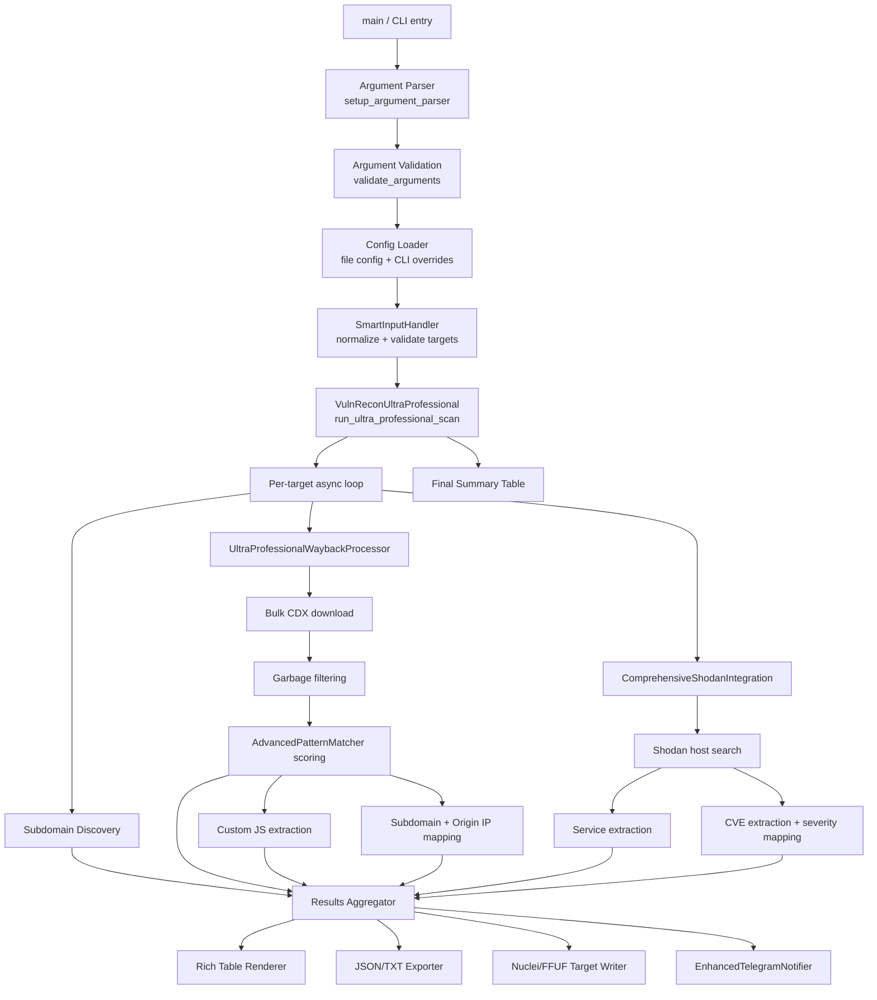

# Architecture

## High-Level Flow



## Component Responsibilities

| Component | File location (class) | Responsibility |
|---|---|---|
| `VulnReconConfig` | dataclass | Holds all runtime configuration; merges file + CLI args |
| `InputAutocorrect` / `SmartInputHandler` | utility classes | Normalize and validate target domains/files |
| `AdvancedPatternMatcher` | scoring engine | Assigns priority/confidence/category to any URL |
| `ComprehensiveShodanIntegration` | API client | Queries Shodan, extracts services + CVEs |
| `UltraProfessionalWaybackProcessor` | pipeline | Orchestrates CDX download → filter → score → classify |
| `EnhancedTelegramNotifier` | notifier | Sends start/progress/completion messages |
| `VulnReconUltraProfessional` | orchestrator | Top-level scan lifecycle, signal handling, banner, summary |

## Concurrency Model

The tool is built on `asyncio` + `aiohttp` for network I/O. Each phase (subdomain discovery, Wayback processing, Shodan lookup) currently runs largely sequentially per target rather than being pipelined across targets, and the advertised `--threads` control is not wired into a semaphore in the reviewed code — see [Known Limitations](../README.md#known-limitations--gaps).

**Suggested target architecture** for a v2 refactor:

```mermaid
flowchart LR
    subgraph Per-Target Worker Pool
    T1[Target 1] --> Sem[asyncio.Semaphore(config.threads)]
    T2[Target 2] --> Sem
    T3[Target N] --> Sem
    end
    Sem --> Pipeline[Discovery → Scoring → Enrichment]
    Pipeline --> Cache[(Local cache: Shodan/CDX responses)]
    Pipeline --> Store[(Results store: JSON/SQLite)]
```

## Data Flow Summary

1. **Input** → validated domain list
2. **Discovery** → subdomains + historical URLs gathered in parallel per target
3. **Scoring** → every URL run through `AdvancedPatternMatcher` for priority/confidence/category
4. **Enrichment** → Shodan adds infrastructure-level context (services, CVEs)
5. **Aggregation** → all signals merged into one results dict per target
6. **Presentation** → Rich tables (interactive) + structured files (persisted) + Telegram (pushed)

## Error Handling Philosophy (current vs. recommended)

**Current:** most exceptions are caught and silently discarded (`except: pass` / `except Exception: pass`), which keeps the tool from crashing mid-scan but hides real problems (auth failures, malformed responses, rate limiting).

**Recommended:** introduce a structured logger (`logging` module) so that:
- `--debug` surfaces full tracebacks
- `--verbose` surfaces warnings (e.g. "Shodan returned 429, backing off")
- default mode stays clean, but errors are still written to a log file for post-mortem review

## Extensibility Points for Contributors

- **New data sources**: add a new `*Processor`/`*Integration` class following the `UltraProfessionalWaybackProcessor` pattern, then wire it into `run_ultra_professional_scan`.
- **New scoring rules**: extend `AdvancedPatternMatcher.sensitive_patterns` / `high_value_extensions`.
- **New output formats**: add a method beside `save_comprehensive_results` (e.g. CSV or SARIF export for CI integration).
- **New notification channels**: mirror `EnhancedTelegramNotifier` for Slack/Discord/webhook support.
