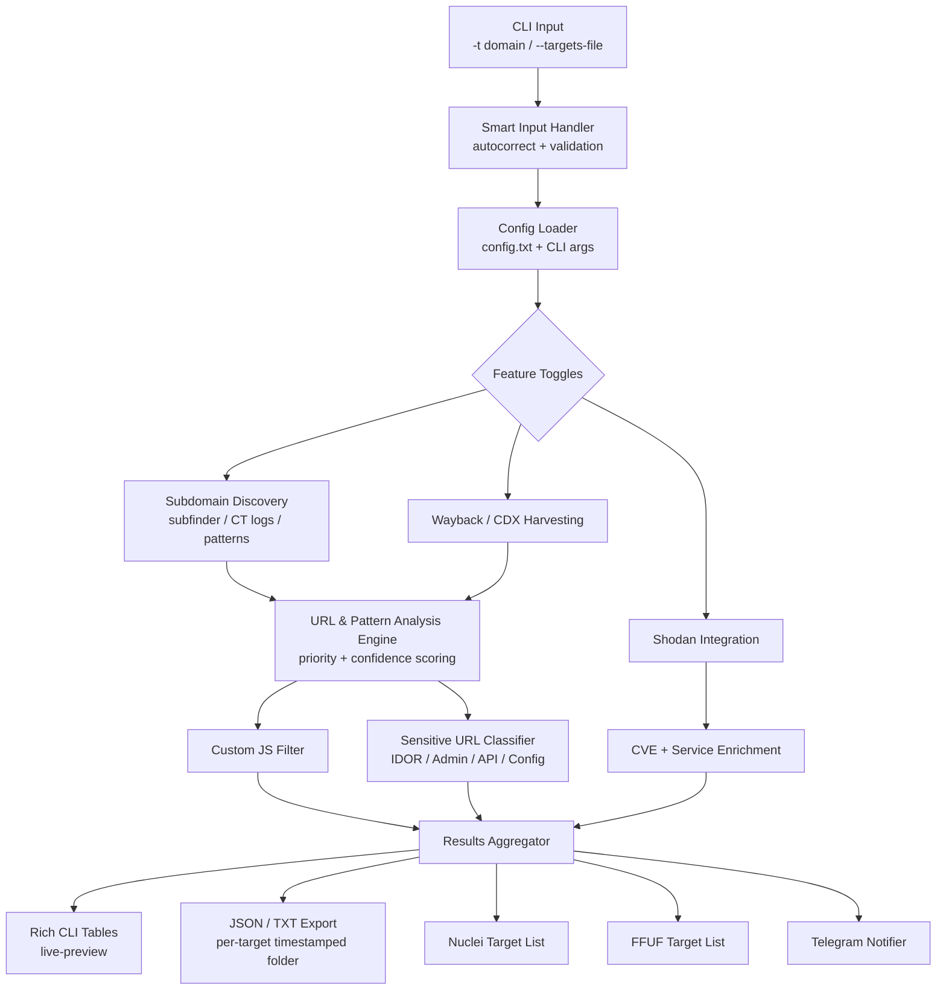
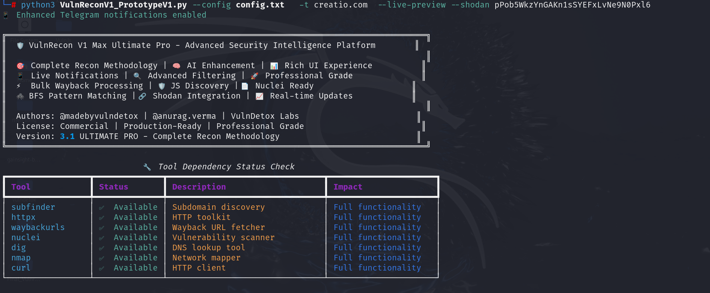
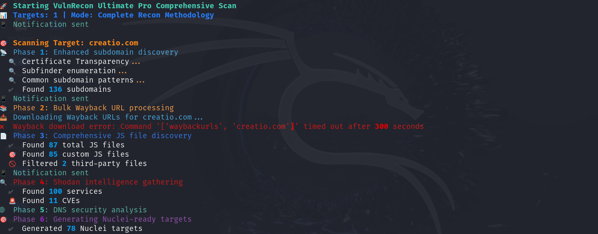
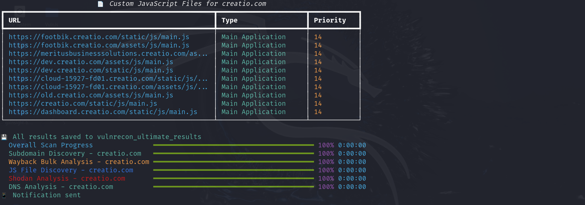
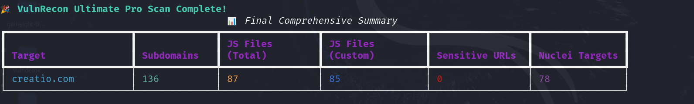

# 🛡️ VulnRecon — Automated Recon & Attack-Surface Intelligence Platform

> Async Python recon tool that chains subdomain enumeration, Wayback Machine mining, JS discovery, and Shodan intelligence into a single, Nuclei/FFUF-ready pipeline — with live Rich-UI output and optional Telegram alerts.

[](https://www.python.org/)
[](LICENSE)
[]()
[](CONTRIBUTING.md)

<p align="center">
  
</p>

---

## Table of Contents

- [Why VulnRecon](#why-vulnrecon)
- [Feature Overview](#feature-overview)
- [Architecture](#architecture)
- [Installation](#installation)
- [Quick Start](#quick-start)
- [Configuration](#configuration)
- [CLI Reference](#cli-reference)
- [Output Structure](#output-structure)
- [Use Cases](#use-cases)
- [Known Limitations & Gaps](#known-limitations--gaps)
- [Roadmap](#roadmap)
- [Contributing](#contributing)
- [Disclaimer & Legal](#disclaimer--legal)
- [License](#license)

---

## Why VulnRecon

Bug bounty and pentest recon usually means gluing together `subfinder | httpx | waybackurls | nuclei` by hand, re-filtering thousands of noisy URLs, and manually spotting the handful of endpoints that matter. VulnRecon wraps that workflow into one async Python tool that:

- Enumerates subdomains and cross-references them with Wayback/CDX history
- Scores every discovered URL for exploitation potential (IDOR, admin panels, config leaks, API endpoints)
- Filters JavaScript files down to first-party/custom code only
- Pulls Shodan service, port, and CVE data for the target's infrastructure
- Emits ready-to-run **Nuclei** and **FFUF** target lists
- Streams progress to the terminal (Rich tables) and optionally to Telegram

This repo consolidates several iterations of the tool (`V1`, `V3.2`, `V4.0 Ultra Professional`) into one maintained, open-source baseline.

## Feature Overview

| Category | Feature | Status |
|---|---|---|
| Recon | Subdomain discovery (subfinder / cert transparency / bruteforce) | ✅ Implemented |
| Recon | Wayback / CDX bulk URL harvesting | ✅ Implemented |
| Recon | Custom vs third-party JS classification | ✅ Implemented |
| Intelligence | Shodan service, port & CVE enrichment | ✅ Implemented (single query) |
| Intelligence | AI-style priority/confidence scoring for URLs | ⚠️ Heuristic, not real ML |
| Output | Rich terminal tables, progress bars, banners | ✅ Implemented |
| Output | Nuclei & FFUF ready target export | ✅ Implemented |
| Output | JSON / TXT structured results per target | ✅ Implemented |
| Notifications | Telegram live updates | ✅ Implemented |
| Safety | Timeout & concurrency limits | ✅ Implemented (V3.2+) |
| Safety | Scope validation / out-of-scope filtering | ⚠️ Partial |
| Testing | Automated tests / CI | ❌ Missing |
| Security | Secrets handling (API keys via CLI) | ❌ Needs hardening |

See [Known Limitations & Gaps](#known-limitations--gaps) for the full audit.

## Architecture



Full component-level breakdown: [`docs/ARCHITECTURE.md`](docs/ARCHITECTURE.md).

## Installation

See the full guide in [`docs/INSTALLATION.md`](docs/INSTALLATION.md). Quick version:

```bash
git clone https://github.com/<your-username>/vulnrecon.git
cd vulnrecon
python3 -m venv venv && source venv/bin/activate
pip install -r requirements.txt

# External Go-based recon tools (required for full functionality)
go install github.com/projectdiscovery/subfinder/v2/cmd/subfinder@latest
go install github.com/projectdiscovery/httpx/cmd/httpx@latest
go install github.com/tomnomnom/waybackurls@latest
go install github.com/projectdiscovery/nuclei/v3/cmd/nuclei@latest
```

## Quick Start

```bash
# Basic scan
python3 vulnrecon.py -t example.com

# Full-feature scan with Shodan + Telegram + live UI
python3 vulnrecon.py -t example.com \
  --shodan YOUR_SHODAN_KEY \
  --telegram BOT_TOKEN:CHAT_ID \
  --live-preview

# Bulk targets from file, high-confidence findings only
python3 vulnrecon.py --targets-file domains.txt --priority 80 --confidence 0.8
```

## Configuration

`config.txt` (key=value, `#` for comments):

```ini
shodan_api_key=
telegram_bot_token=
telegram_chat_id=
threads=20
timeout=10
priority_threshold=0
confidence_threshold=0.0
output_dir=vulnrecon_results
```

> ⚠️ **Do not commit `config.txt` with real keys.** Add it to `.gitignore` and ship `config.example.txt` instead (included in this repo).

## CLI Reference

| Flag | Description | Default |
|---|---|---|
| `-t, --targets` | Single domain or comma-separated list | — |
| `--targets-file` | File with one domain per line | — |
| `--shodan` | Shodan API key | — |
| `--telegram` | `BOT_TOKEN:CHAT_ID` | — |
| `--priority` | Minimum priority score (0–100) | 0 |
| `--confidence` | Minimum confidence (0.0–1.0) | 0.0 |
| `--samples` | Samples shown per table category | 10 |
| `--live-preview` | Rich live progress UI | off |
| `--threads` | Concurrent workers | 20 |
| `--timeout` | HTTP timeout (s) | 10 |
| `--fast` / `--deep` | Speed vs thoroughness presets | off |
| `-o, --output` | Output directory | `vulnrecon_ultra_results` |
| `-v, --verbose` / `--debug` / `--quiet` | Logging verbosity | off |
| `--detailed-help` | Extended in-tool help text | — |

Full explanation with worked examples: [`docs/USAGE.md`](docs/USAGE.md).

## Output Structure

```
vulnrecon_results/
├── <target>_<timestamp>/
│   ├── comprehensive_results_<target>_<ts>.json
│   ├── subdomains/           new_subdomains.txt
│   ├── js_files/              custom_js_files.txt
│   ├── wayback/                sensitive_urls.json, categorized_urls.json
│   ├── shodan/                  services.txt, cves.txt, ports.txt
│   ├── nuclei/                   nuclei_targets.txt
│   ├── ffuf/                      ffuf_targets.txt
│   └── summary/                    comprehensive_summary.txt
```

## Use Cases

- **Bug bounty triage** — quickly surface IDOR-prone URLs, exposed `.env`/`.sql`/`.csv` files, and forgotten admin panels across a large scope.
- **Attack surface mapping** — combine subdomain + Wayback + Shodan data to build an inventory of exposed assets before a pentest engagement.
- **Continuous recon** — schedule against a bug bounty program's scope and get Telegram alerts only for high-priority findings.
- **JS-based secret hunting** — feed the "custom JS" output into a secret scanner (TruffleHog/Gitleaks) instead of scanning thousands of third-party library files.
- **Nuclei pipeline feeder** — use generated `nuclei_targets.txt` directly: `nuclei -l nuclei_targets.txt -severity critical,high`.

## Known Limitations & Gaps

This is an honest audit from reading the current codebase — useful as a contributor onboarding doc.

1. **Silent exception swallowing** — most network calls use bare `except: pass`, which hides real failures (rate limits, auth errors, DNS issues) from the user. Should log at `--debug` level instead of discarding.
2. **Shodan integration is a single unpaginated query** — `_execute_shodan_search` fetches one page (`limit=50`) and does not paginate, retry on 429, or cache results, so large targets under-report services/CVEs.
3. **`threads` config value is unused** — the argument exists but async concurrency isn't actually bounded by a semaphore in the reviewed flow, risking accidental DoS-like request bursts against targets.
4. **API keys passed via CLI args** — `--shodan` / `--telegram` on the command line land in shell history and `ps` output. Should support environment variables (`VULNRECON_SHODAN_KEY`) and `.env` files.
5. **Domain autocorrection list is hardcoded and tiny** (`goggle.com`→`google.com`) — cute but not a real fuzzy-matching system; low value, possibly remove or replace with Levenshtein-based suggestions.
6. **Third-party JS filter is a static keyword list** (`jquery`, `bootstrap`, `cdn`, etc.) — easily produces false negatives for self-hosted third-party libraries and false positives for legitimately custom files that happen to contain a filtered word.
7. **No automated tests or CI** — no `pytest` suite, no GitHub Actions workflow validating that a scan completes or that parsers handle malformed CDX/Shodan responses.
8. **No scope/out-of-scope enforcement** — marketing text claims "scope validation" but the reviewed logic only checks subdomain suffix match, not bug-bounty program scope files (e.g. HackerOne scope JSON).
9. **Duplicate/overlapping script versions** — `V1`, `v3.2 fixed`, and `V4.0 Ultra Professional` exist as separate files with drifting feature sets instead of one versioned, tested codebase. Needs consolidation before this can be a credible open-source project.
10. **No rate limiting for Wayback/CDX or subdomain brute force** — large scopes can trigger throttling or get the scanner IP blocked.
11. **Nuclei/FFUF integration is target-list generation only** — the tool does not invoke `nuclei`/`ffuf` itself, so "Nuclei Ready" is really "Nuclei Input File Ready"; documentation should be precise about this to avoid confusion.
12. **No unified logging** — output goes through a mix of `console.print` and bare `print`, making structured log analysis (e.g., piping into a SIEM) difficult.

## Roadmap

- [ ] Consolidate `V1` / `V3.2` / `V4.0` into a single versioned package (`src/vulnrecon/`)
- [ ] Add `pytest` unit tests + GitHub Actions CI (lint, test, build)
- [ ] Environment-variable & `.env` support for secrets; remove keys from `ps`-visible args
- [ ] Bound concurrency with `asyncio.Semaphore(config.threads)`
- [ ] Shodan pagination, retry/backoff, and local caching
- [ ] Pluggable scope-file support (HackerOne/Bugcrowd JSON scope import)
- [ ] Optional direct Nuclei/FFUF invocation (`--auto-nuclei`) behind an explicit opt-in flag
- [ ] Structured JSON logging mode
- [ ] Docker image + `docker-compose.yml` for one-command setup
- [ ] Web dashboard (optional) for browsing historical scan results

Contributions against any of these are very welcome — see [CONTRIBUTING.md](CONTRIBUTING.md).

## Contributing

We welcome issues and PRs. Please read [`CONTRIBUTING.md`](CONTRIBUTING.md) before submitting changes, especially around responsible-use requirements.

## Disclaimer & Legal

VulnRecon is intended **only** for security testing against targets you own or are explicitly authorized to test (e.g., in-scope bug bounty programs, contracted pentests). Running active reconnaissance or vulnerability scanning against systems without authorization may violate the Computer Fraud and Abuse Act (US), the Computer Misuse Act (UK), or equivalent laws elsewhere. The authors and contributors accept no liability for misuse.

## License

Released under the [MIT License](LICENSE) — see file for details.

---

<p align="center">Made with ☕ by the open-source security community — forked/refactored from VulnDetox Labs' original VulnRecon prototypes.</p>








